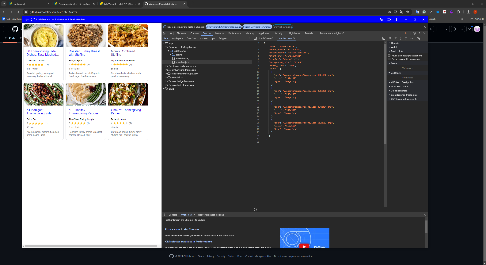

# Lab8-Starter
Po-Yu Lai

### Page:
[https://astraeven0502.github.io/Lab8-Starter/](https://astraeven0502.github.io/Lab8-Starter/)

### How are graceful degradation and service workers related?

Graceful degradation makes sure that an application can still work even in less capable environments. We can start with max technology and address lower levels if needed(That's to say, we catch the need to degrade) because, by Service Workers, it allows us to be able to access even if we have bad or no internet connection. So Service workers can be a great tool to achieve the idea of graceful degradation.

### PWA
